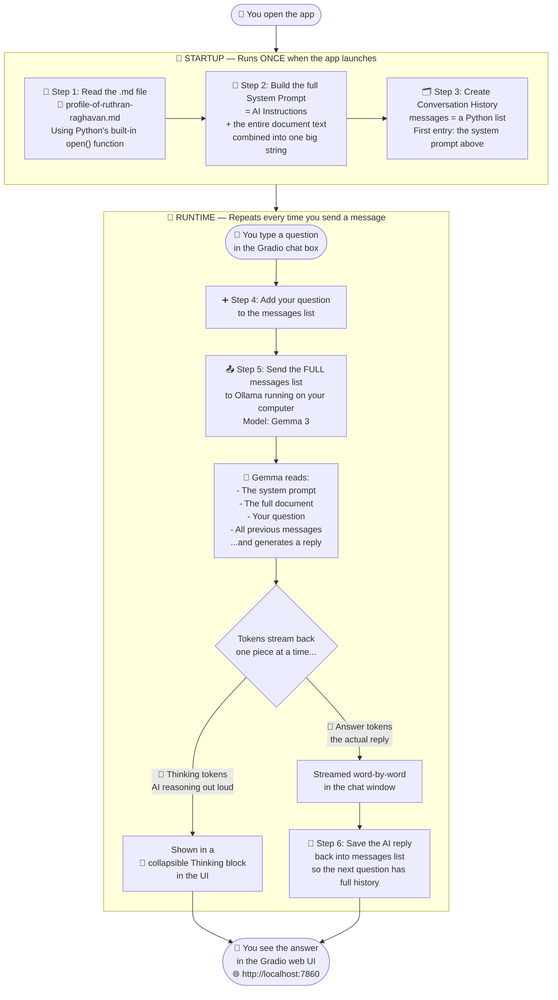

## 📄 Project 1: Chatbot with Text RAG

> **What is RAG?**
> RAG stands for **Retrieval-Augmented Generation**. Instead of relying only on what the AI was trained on, we *give* the AI extra knowledge by including a document inside the question we send it. Think of it like giving someone a cheat sheet before an exam!

---

## How This Project Works (Plain English)

1. When the app starts, it **reads a Markdown (.md) text file** — a profile document about Ruthran Raghavan.
2. It **glues that document's text** onto the beginning of the system prompt (the AI's instructions).
3. Every time you ask a question, the AI **already has the full document in memory** — it was loaded just once at startup.
4. The AI answers using **only what is in that document** and says "I can't find that" if the answer is not there.
5. The **full conversation is remembered** in a list, so you can ask follow-up questions naturally.Architecture Diagram



---

## File Map — What Each File Does

| File                                  | What it does                                                                              |
| ------------------------------------- | ----------------------------------------------------------------------------------------- |
| `app.py`                            | Launches the**Gradio web UI** — the chat window you open in your browser           |
| `chatbot.py`                        | The**brain** — reads the document, manages conversation history, calls Ollama      |
| `system_prompt_simple.py`           | Short**instructions** that tell the AI how to behave (e.g. "only use the document") |
| `profile-of-ruthran-raghavan-...md` | The**knowledge file** — its text is injected into the AI's memory at startup       |

---

## The Core Idea 💡

```
Document Text + System Instructions  →  System Prompt
System Prompt + Your Question        →  Sent to AI
AI                                   →  Answer based on the document
```

> ⚠️ **Limitation to know about:** AI models can only read a certain amount of text at once — this is called the **context window**. If the document is very long (e.g. a 200-page book), pasting the whole thing into the prompt would fail. Projects 2 and 3 tackle this same idea with progressively better approaches!
