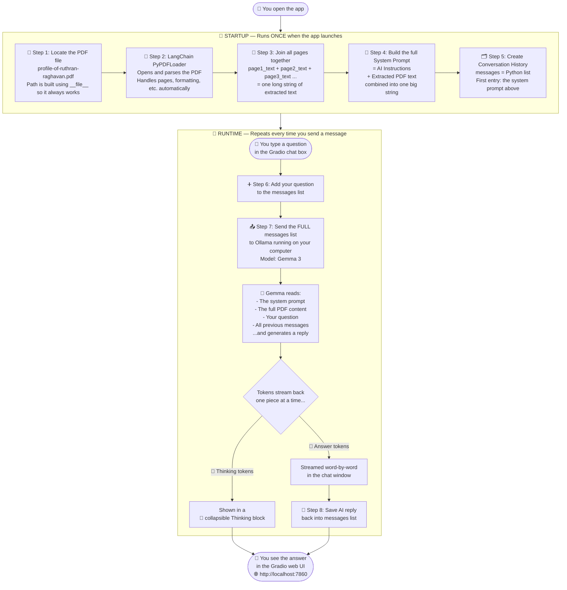
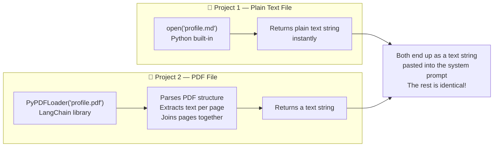

# 📑 Project 2: Chatbot with PDF RAG

> **What is different vs Project 1?**
> Project 1 read a plain `.md` text file. This project reads a **PDF file** — which is more complex because PDFs have pages, formatting, headers, etc. We use a library called **LangChain** with `PyPDFLoader` to handle that complexity for us automatically.

---

## How This Project Works (Plain English)

1. When the app starts, it **opens the PDF file** using LangChain's `PyPDFLoader`.
2. The loader **extracts the text from every page** and joins it all into one long string.
3. That extracted text is **combined with the system prompt**, exactly like Project 1.
4. The combined prompt becomes the **first entry** in the conversation history list.
5. Every question you ask is answered using **only what was in the PDF**.
6. The conversation history is remembered so you can ask follow-up questions.

---

## Architecture Diagram



---

## How is This Different from Project 1?



> The only real difference is **how we get the text out of the file**. Once we have the text, everything else — conversation history, Ollama, Gradio streaming — works exactly the same as Project 1.

---

## File Map — What Each File Does

| File | What it does |
|---|---|
| `app.py` | Launches the **Gradio web UI** — the chat window in your browser |
| `chatbot.py` | Loads the **PDF**, manages conversation history, calls Ollama |
| `system_prompt_simple.py` | Short instructions telling the AI how to behave |
| `profile-of-ruthran-raghavan-...pdf` | The **knowledge document** as a PDF this time! |

---

## The Core Idea 💡

```
PDF File  →  PyPDFLoader  →  Extracted Text  →  System Prompt  →  AI has the knowledge
```

> ⚠️ **Same limitation as Project 1:** The entire PDF content is still pasted into every prompt. For large documents this would overflow the AI's **context window** (its reading limit). Project 3 solves this with a smarter approach called a **vector database**!
