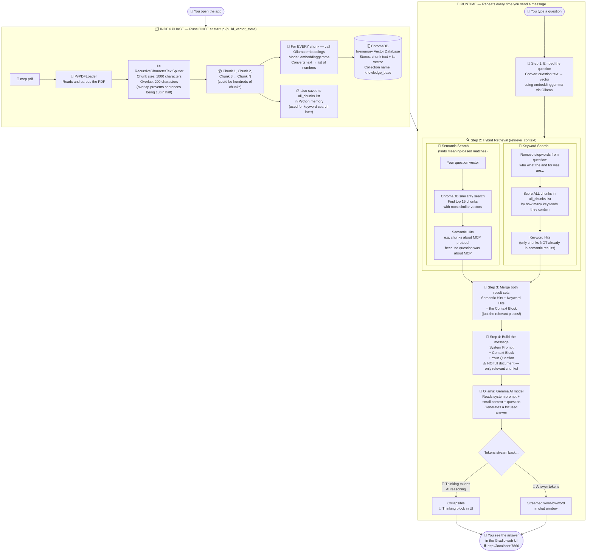
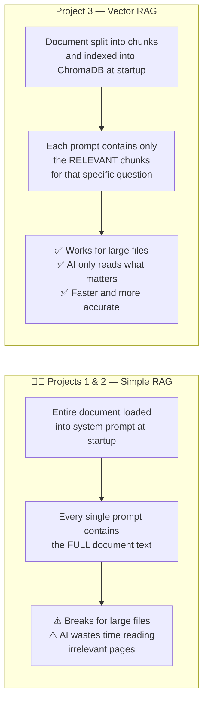

# 🧠 Project 3: Chatbot with Vector RAG (The Smart Way!)

> **What is different from Projects 1 & 2?**
> Those projects pasted the **entire document** into every prompt — which works only for small files. Project 3 is smarter: it uses a **vector database** to find and send only the *relevant pieces* of the document for each question.

---

## Two New Concepts to Understand First

### 📐 What is an Embedding (Vector)?
An embedding turns a sentence into a **list of numbers**. The clever part: sentences with *similar meaning* end up with *similar numbers*. This lets a computer compare meaning, not just matching words.

```
"Who is Ruthran?"         →  [0.12, 0.87, 0.34, 0.56, ...]
"Tell me about Ruthran"   →  [0.11, 0.85, 0.36, 0.54, ...]
                                ↑ very similar numbers = similar meaning!

"What is the weather?"    →  [0.91, 0.02, 0.77, 0.11, ...]
                                ↑ very different numbers = different meaning
```

### 🗄️ What is a Vector Database (ChromaDB)?
A special database that stores text chunks alongside their vectors (numbers). You can ask it: *"find me the 15 text chunks whose meaning is closest to this question"* — and it answers in milliseconds.

---

## How This Project Works (Plain English)

**Phase 1 — Index (at startup, runs once):**
1. Load `mcp.pdf` and **cut it into small overlapping pieces** (chunks of 1000 characters, overlapping by 200 so no sentence is cut in half).
2. Convert every chunk into a **vector (list of numbers)** using the `embeddinggemma` model via Ollama.
3. Store each chunk + its vector in **ChromaDB** (an in-memory vector database).
4. Also keep the raw text chunks in a plain Python list (`all_chunks`) for keyword searching later.

**Phase 2 — Retrieve & Answer (every question):**
5. Convert your question into a vector too.
6. **Semantic Search**: Ask ChromaDB to find the 15 chunks most similar in *meaning* to your question.
7. **Keyword Search**: Also scan all chunks for exact word matches — catches names or specific terms that semantic search might miss.
8. Merge both results into a small **context block** — just the relevant pieces, not the whole document!
9. Send: System Prompt + Context + Your Question → AI generates a focused answer.

---

## Architecture Diagram



---

## Projects 1 & 2 vs Project 3 — The Key Difference



---

## File Map — What Each File Does

| File | What it does |
|---|---|
| `app.py` | Launches the **Gradio web UI** — handles chat display with thinking blocks |
| `chatbot.py` | **Everything**: indexing, embedding, hybrid retrieval, streaming |
| `system_prompt_simple.py` | Short instructions for the AI — the document is NOT injected here |
| `mcp.pdf` | The knowledge document — gets chunked and stored in ChromaDB at startup |

---

## The Core Idea 💡

```
INDEX:    PDF → Chunks → Vectors → ChromaDB
          (done once at startup)

RETRIEVE: Question → Vector → ChromaDB finds similar chunks
          + keyword scan of all_chunks
          → Context Block (just the relevant pieces)

GENERATE: System Prompt + Context Block + Question → Gemma AI → Answer
```

> ✅ **Why this is powerful:** A 500-page document would be split into ~2000 chunks. For any given question, only 15-25 chunks are retrieved. The AI only ever reads a tiny, highly relevant slice — making it faster, smarter, and able to handle documents of any size!
